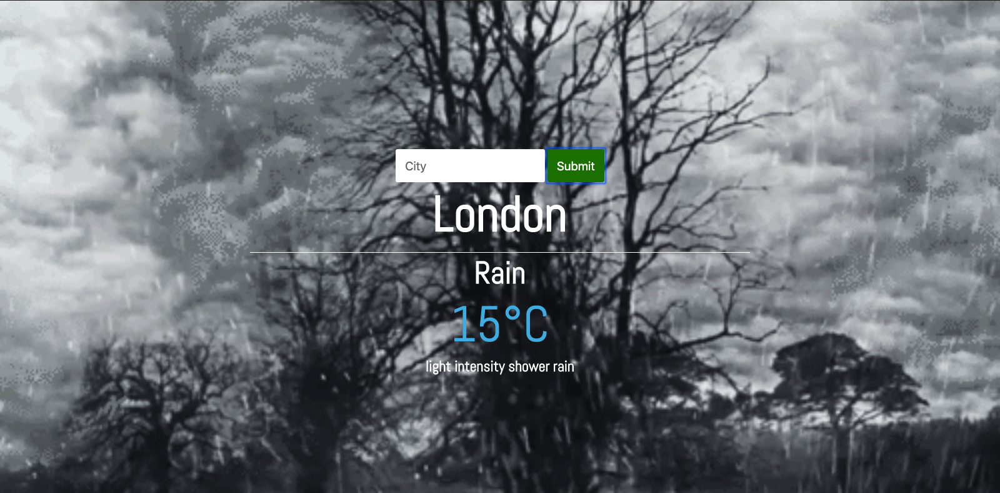

# Weather-app
A browser based weather application using the OpenWeather API

## Technologies
HTML

CSS

JavaScript

openweatherapi

## Requirements

Browser

Npm (optional to use live-server)- npm install live-server

## Installation
> Open your git bash and **cd** to the location you'd like to put your files the run the command below.

`git@github.com:AdnanAfsari/Weather-app.git`

#### To use without server

**cd** to into the project folder and open the `index.html` file with your browser

#### To user with server

**cd** into the project folder,` and start the server by doing `live-server` then it will open up `http://127.0.0.1:8080/` on your browser

## Author

[Adnan Afsari](https://github.com/AdnanAfsari)
